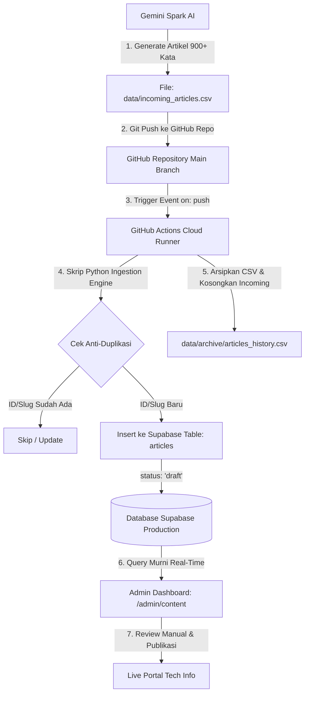

# 🚀 BLUEPRINT ARSITEKTUR PIPELINE CSV + GITHUB ACTIONS + SUPABASE
## NEXARIN INFORMATION INTELLIGENCE — AUTONOMOUS 24/7 CI/CD INGESTION SYSTEM

Dokumen ini merupakan panduan arsitektur teknis dan langkah-langkah implementasi (*step-by-step roadmap*) untuk mengotomatiskan seluruh alur kurasi artikel teknologi dari **Gemini Spark (CSV Format)** langsung ke **Database Supabase (`articles`)** menggunakan **GitHub Actions**, sehingga dashboard admin Nexarin secara otomatis memuat artikel siap review tanpa perlu sinkronisasi manual.

---

## 1. IKHTISAR ARSITEKTUR & DIAGRAM SISTEM



---

## 2. SPESIFIKASI FORMAT CSV (100% SESUAI KOLOM SUPABASE `articles`)

Setiap baris yang dihasilkan oleh Gemini Spark di file `data/incoming_articles.csv` memiliki 18 kolom terstruktur:

| No | Nama Kolom CSV | Tipe Data | Deskripsi & Contoh Nilai |
|---|---|---|---|
| 1 | `id` | String (PK) | Format `NXR-2026-XXXX` (contoh: `NXR-2026-0001`) |
| 2 | `created_at` | Timestamp | Format ISO 8601 (contoh: `2026-08-31T00:00:00Z`) |
| 3 | `title` | String | Judul editorial tajam, informatif, bebas clickbait |
| 4 | `slug` | String (Unique) | URL slug SEO-friendly (contoh: `anthropic-model-hardware-standard`) |
| 5 | `category_id` | String (FK) | Salah satu dari: `ai`, `technology`, `digital`, `gadget`, `automotive` |
| 6 | `subcategory` | String | Sub-kategori spesifik (contoh: `Agentic AI & Robotics`) |
| 7 | `tags` | String (Koma) | Kata kunci tanpa tagar (contoh: `AI, Anthropic, Robotics`) |
| 8 | `excerpt` | String | Ringkasan eksekutif 2–3 kalimat padat wawasan |
| 9 | `content` | Text (900+ kata) | Naskah lengkap 6 bab terstruktur, 1 baris kosong per paragraf |
| 10 | `opinion` | Text | Analisis redaksi diawali: `"Menurut analisis redaksi Nexarin..."` |
| 11 | `key_takeaways` | Text | 3–5 poin kesimpulan penomoran angka biasa |
| 12 | `reading_time` | String | Estimasi waktu baca (contoh: `6 min baca`) |
| 13 | `source_name` | String | Nama newsroom sumber (contoh: `Anthropic Newsroom`) |
| 14 | `source_url` | String | URL valid publikasi primer sumber |
| 15 | `featured_image` | String | URL gambar relevan Unsplash 16:9 |
| 16 | `meta_title` | String | SEO Title artikel |
| 17 | `meta_description` | String | SEO Description artikel |
| 18 | `status` | String | **WAJIB SELALU `"draft"`** |

---

## 3. STRATEGI ANTI-DUPLIKASI 3 LAPIS (ZERO DUPLICATE GUARANTEE)

1. **Lapisan 1 (AI Level - Gemini Spark Prompt Directive)**:
   - Gemini Spark membaca riwayat ID dan Slug yang pernah dibuat pada file arsip.
   - Aturan tegas melarang pembuatan artikel untuk peristiwa atau URL sumber yang sama.
2. **Lapisan 2 (CI/CD Runner Level - Python Ingestion Engine)**:
   - Sebelum melakukan *insert*, skrip mengambil seluruh daftar `id` dan `slug` yang sudah ada di Supabase:
     `SELECT id, slug FROM articles`
   - Jika ada baris CSV yang memiliki `id` atau `slug` yang sudah ada, baris tersebut secara otomatis dilewati (*Skipped*).
3. **Lapisan 3 (Database Engine Level - PostgreSQL Constraints)**:
   - Kolom `id` adalah *Primary Key*.
   - Kolom `slug` memiliki *Unique Index*.
   - Menggunakan query `ON CONFLICT (id) DO UPDATE` / `DO NOTHING` sehingga database fisik menolak duplikasi secara mutlak.

---

## 4. RANCANGAN WORKFLOW GITHUB ACTIONS (`.github/workflows/sync-articles.yml`)

Workflow akan berjalan secara instan dan otomatis di cloud server GitHub:

```yaml
name: Autonomous Article Ingestion to Supabase

on:
  push:
    paths:
      - 'data/incoming_articles.csv'
  schedule:
    - cron: '*/5 * * * *' # Fallback cron setiap 5 menit
  workflow_dispatch: # Tombol manual trigger jika dibutuhkan

jobs:
  ingest:
    runs-on: ubuntu-latest
    steps:
      - name: Checkout Repository
        uses: actions/checkout@v4
        with:
          token: ${{ secrets.GITHUB_TOKEN }}

      - name: Setup Python
        uses: actions/setup-python@v5
        with:
          python-version: '3.12'

      - name: Install Dependencies
        run: pip install requests

      - name: Run Ingestion Engine
        env:
          SUPABASE_URL: ${{ secrets.NEXT_PUBLIC_SUPABASE_URL }}
          SUPABASE_SERVICE_ROLE_KEY: ${{ secrets.SUPABASE_SERVICE_ROLE_KEY }}
        run: python scripts/ingest_csv_to_supabase.py

      - name: Commit and Archive Ingested CSV
        run: |
          git config --global user.name "Nexarin Autonomous Bot"
          git config --global user.email "bot@nexarin.com"
          git add data/
          git diff-index --quiet HEAD || git commit -m "chore(auto): Ingest and archive processed articles [skip ci]"
          git push origin main
```

---

## 5. STEP-BY-STEP IMPLEMENTASI SISTEM

Berikut adalah tahapan pengerjaan sistematis yang akan kita eksekusi:

### 🔹 Langkah 1: Pembuatan Struktur Folder & File CSV Staging
- Membuat folder `data/` dan file template `data/incoming_articles.csv` dengan 18 header kolom resmi.
- Membuat folder arsip `data/archive/` untuk menyimpan rekaman seluruh artikel yang sudah berhasil masuk ke Supabase.

### 🔹 Langkah 2: Pembuatan Skrip Ingestion Engine (`scripts/ingest_csv_to_supabase.py`)
- Skrip Python berkecepatan tinggi yang membaca `data/incoming_articles.csv`.
- Menerapkan parser RFC 4180 untuk mendukung teks artikel 900+ kata.
- Melakukan verifikasi anti-duplikasi terhadap database Supabase.
- Mengunggah baris baru ke tabel Supabase `articles` dengan `status: "draft"`.
- Memindahkan data yang selesai diproses ke `data/archive/articles_history.csv` dan mengosongkan `incoming_articles.csv`.

### 🔹 Langkah 3: Konfigurasi GitHub Actions Workflow (`.github/workflows/sync-articles.yml`)
- Membuat file workflow YAML di repository.
- Mengonfigurasi *trigger* `on: push` pada folder `data/incoming_articles.csv` dan cron fallback 5 menit.
- Menghubungkan GitHub Secrets (`SUPABASE_URL` dan `SUPABASE_SERVICE_ROLE_KEY`).

### 🔹 Langkah 4: Penyesuaian Master Prompt (`GEMINI_SPARK_MASTER_PROMPT.md`)
- Mengubah instruksi output Gemini Spark dari Google Sheets menjadi format **CSV File Output** dengan 18 kolom terstruktur.
- Mempertahankan seluruh aturan kualitas jurnalistik (minimal 900 kata, 6 bab, bebas simbol `#` dan `*`, 1 baris kosong per paragraf, anti-halusinasi, rotasi 5 kategori).

### 🔹 Langkah 5: Penyesuaian Dashboard Admin Nexarin (`/admin/content`)
- Memastikan antarmuka **Drafts Staging (Gemini Spark)** murni membaca secara *real-time* dari tabel Supabase `articles` (`status = 'draft'`).
- Mengoptimalkan tombol review, live preview, edit naskah, dan publikasi ke Live Portal.

### 🔹 Langkah 6: Validasi Build, Pengujian End-to-End, & Push ke GitHub
- Menjalankan `npm run build` untuk memastikan 0 error pada seluruh 69 rute aplikasi.
- Melakukan *commit* dan *push* ke GitHub repository.

---

## 6. HASIL AKHIR YANG AKAN DIPEROLEH

1. **100% Otomatis Tanpa Sentuhan Manual (Hands-Free 24/7)**:  
   Gemini Spark menghasilkan CSV → GitHub Actions mengunggah ke Supabase → Artikel seketika muncul di dashboard admin.
2. **Zero Error & Anti-Duplikasi**:  
   Tidak ada lagi delay koneksi pihak ketiga, tidak ada kuota spreadsheet, dan tidak akan ada artikel ganda di portal.
3. **Pusat Editorial yang Sangat Cepat**:  
   Admin cukup membuka `/admin/content`, membaca naskah kurasi, dan menekan tombol publikasi!
